# Summary

This is a version of PKMN Crystal with stuff that I’d like to have in it (i.e. more Ghost types).  It isn’t a
complete overhaul or anything close to it, these are just a couple of things that I liked to have added, so I did.

The `main` branch is in German, but there’s also an `english` branch.

Based on the 16-bit monster and move index patches from https://github.com/vulcandth/pokecrystal16 (I rebased
https://github.com/pret/pokecrystal on top of that); I got the data for the German version from
https://github.com/mid-kid/pokecrystal (with a lot of manual fix-up, and I definitely missed some stuff).

# Added Mons

|Name|Back|Front|How to obtain|Notes|
|:-:|:-:|:-:|:-|:-|
|252 Mimikyu| |   |<ul><li>Route 46, at night</li><li>Ecruteak City gym</li></ul>|Has Disguise|
|253 Litwick|| |<ul><li>Ecruteak City gym</li><li>Burned tower’s basement, at night</li><li>Overworld in the burned tower’s basement, at night (shiny, level 23)</li></ul>||
|254 Lampent|| |<ul><li>Evolves from Litwick at level 41</li></ul>||
|255 Chandelure|| |<ul><li>Evolves from Lampent at level 55</li></ul>||
|256 Drifloon|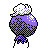| |<ul><li>National park, at night</li><li>Ecruteak City gym (surfing)</li></ul>||
|257 Drifblim|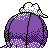| |<ul><li>Evolves from Drifloon at level 28</li></ul>||
|258 Sinistea|| |<ul><li>Ecruteak City gym</li><li>Route 38, at night</li>||
|259 Polteageist|| |<ul><li>Evolves from Sinistea at level 28</li></ul>||
|260 Mismagius|| |<ul><li>Evolves from Misdreavus at level 41</li><li>Mt. Silver Cave’s 2F and item rooms, at night</li></ul>||
|261 Sandygast|| |<ul><li>Under smashable rocks</li></ul>
|262 Palossand|| |<ul><li>Evolves from Sandygast at level 42</li></ul>||
|263 Zorua|| |<ul><li>Overworld in Mt. Mortar (level 25)</li></ul>||
|264 Zoroark|| |<ul><li>Evolves from Zorua at level 30</li></ul>||
|265 Phantump|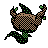| |<ul><li>Can be bred from Trevenant</li></ul>||
|266 Trevenant|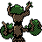| |<ul><li>Evolves from Phantump by trading</li><li>Overworld on Route 36, on Saturday night</li></ul>||
|267 Dreepy|| |<ul><li>Dragon’s Den (surfing)</li></ul>||
|268 Drakloak|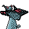| |<ul><li>Evolves from Dreepy at level 50</li></ul>||
|269 Dragapult|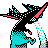| |<ul><li>Evolves from Drakloak at level 60</li></ul>||
|270 Honedge|| |<ul><li>Route 37, at night</li></ul>||
|271 Doublade|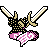|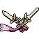 |<ul><li>Evolves from Honedge at level 35</li></ul>||
|272 Aegislash| |   |<ul><li>Evolves from Aegislash at level 48</li></ul>|Has Stance Change|
|273 Snorunt|| |<ul><li>Ice Path, at night</li></ul>|Female only|
|274 Froslass|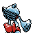| |<ul><li>Evolves from Snorunt at level 42</li></ul>||
|275 Greavard||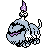 |<ul><li>Route 34, at night</li></ul>||
|276 Houndstone|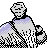| |<ul><li>Evolves from Greavard at level 30</li></ul>||
|277 Marshadow|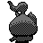| |<ul><li>Overworld in Cianwood City, at night</li></ul>||
|278 Rotom|| |<ul><li>Route 35, at night</li><li>Route 10 (outside of the Power Plant), at night</li></ul>||
|279 Golett|| |<ul><li>Union Cave, at night</li><li>Route 45, at night</li></ul>||
|280 Golurk|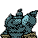| |<ul><li>Evolves from Golett at level 43</li></ul>||
|281 Frillish|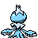| |<ul><li>Ecruteak City gym (surfing)</li></ul>|Male only|
|282 Jellicent|| |<ul><li>Evolves from Frillish at level 40</li></ul>||
|283 Pumpkaboo|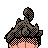| |<ul><li>Ilex Forest, at night</li></ul>||
|284 Gourgeist|| |<ul><li>Evolves from Pumpkaboo by trading</li></ul>||
|285 Poltchageist|| |<ul><li>Gift in Ecruteak City</li></ul>||
|286 Sinistcha|| |<ul><li>Evolves from Poltchageist at level 28</li></ul>||

# Added Moves

* Astonish
* Earth Power
* Flame Burst
* Hex
* Hone Claws
* Inferno
* Moonblast
* Play Rough
* Shadow Claw
* Shadow Sneak
* Shell Smash
* Stored Power
* Will-O-Wisp
* Wood Hammer
* Horn Leech
* Matcha Gotcha
* Dragon Dance
* Dragon Rush
* Dragon Darts

# Gym Leader Changes

All gym leaders, all elite four member, and the champ have at least one ghost type.  In addition, I supposed if I was
already this far, I might as well help myself to a gym; so I took over Ecruteak City’s gym.

# All Mon Obtainable

* Ida in the guardhouse north of Mahagony City will trade any mon, just returning what you gave her; this allows
  evolving trade-only evolutions.
* The Celadon City department store again stocks the evolution stones, including Moon Stones.
* Bulbasaur can be caught on Route 2, in the morning.
* Charmander can be caught on Cinnabar Island, in the morning.
* Squirtle can be caught on Route 21, in the morning.
* Vulpix can be caught on Cinnabar Island, during the morning and day.
* Mankey can be caught on Route 9 and 42, during the morning and day.
* Omanyte can be caught surfing in the Lugia’s chamber in the Whirl Islands.
* Kabuto can be caught surfing in the Lugia’s chamber in the Whirl Islands.
* Articuno is in the Ice Path.
* Zapdos is in the Power Plant.
* Moltres is in Victory Road.
* Mewtwo is near the entrance of its old cave.
* Mew is in Mount Silver.
* Chikorita can be caught on Route 38, in the morning.
* Cyndaquil can be caught on Route 45, during the day.
* Totodile can be found by surfing in New Bark Town.
* Mareep can be caught on Route 38, during the day.
* Girafarig can be caught on Route 43.
* Remoraid can be caught with the Super Rod on Route 44.
* Catching the shiny Litwick in the burned tower’s basement yields the GS ball.

Also simply changed some catch locations so they are available more early on:

* Murkrow can be caught outside of the Ruins of Alph, at night.
* Misdreavus can be caught in the Dark Cave, at night.  It no longer appears in the Mt. Silver Cave.
* Houndour can be caught in the Burned Tower, at night.
* Larvitar can be caught on Route 45, at night.

# Miscellaneous

* “New game+”: Professor Elm’s PC in New Bark Town allows storing eggs; those
  eggs will remain there even when starting a new game
* Per-move physical/special split
* Fairy type
* Bug fixes suggested by the pokecrystal documentation
* Made EXP gain depend on player mon, too, similar to Gen V
* Strongly raised general levels
* Light ball raises both attack and special attack; also works on Mimikyu (yes, me liking Mimikyu is the whole reason
  for this whole thing)
* Move tutor now costs 4000 PKMN Dollars instead of coins, and appears before beating the elite four
* TMs have infinite uses
* Added “Reset Clock” main menu item, and remove the password requirement
* Removed Steel’s resistance against Ghost and Dark
* Updated move stats (power, priority)
* Removed Flash requirement from Mt. Silver Cave
